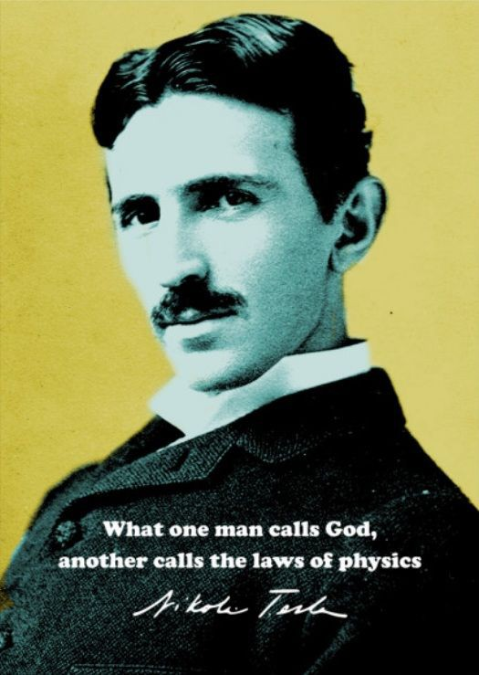
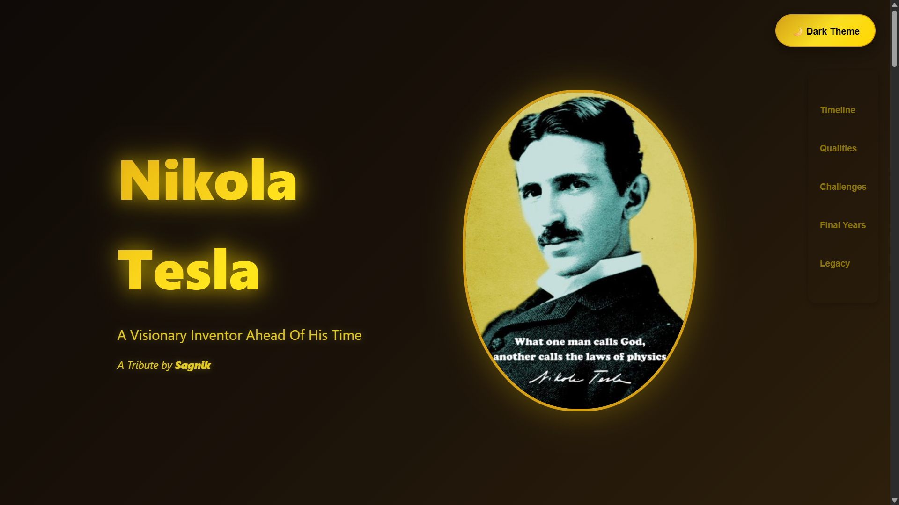

<div align="center"></div>

# <div align="center">Nikola Tesla - Illuminating Legacies</div>

## A JavaScript-based Modern Tribute to the Visionary Inventor

This interactive tribute webpage celebrates the life, achievements, and enduring legacy of Nikola Tesla - the brilliant scientist whose visionary ideas shaped our modern world. Through elegant design and engaging interactivity, we honor the man who saw beyond what the human mind could perceive.

## ✨ Experience the Tribute

[](https://eccentriccoder01.github.io/Nikola-Tesla-Illuminating-Legacies)

 <div align="center">
 <p>

[](https://github.com/ellerbrock/open-source-badges/)


 </p>
 </div>

## 🌟 Key Features of This Tribute

* **Interactive Timeline**: Explore Tesla's life journey through beautifully animated timeline events
* **Visual Storytelling**: Engaging sections highlighting his qualities, challenges, and legacy
* **Modern Design**: Elegant dark theme with golden accents and particle animations
* **Responsive Layout**: Fully accessible on all devices from desktop to mobile
* **Interactive Elements**: Hover effects, scroll animations, and click interactions
* **Theme Toggle**: Switch between light and dark modes for comfortable viewing
* **Parallax Effects**: Dynamic scrolling experience with layered animations
* **Tesla-Inspired Visuals**: Electrical particle effects and glowing elements

## 📸 Screenshots

<div align="center"></div>

## 📺 Video

To know more never-heard-before facts about the visionary scientist, check out this video:

**[Insert YouTube Video Link Here]**

## 🧭 Navigation

- **Timeline**: Key events from Tesla's remarkable life
- **Qualities**: The extraordinary characteristics that defined him
- **Challenges**: The obstacles and setbacks he faced
- **Final Years**: His later life and passing
- **Legacy**: How Tesla's work continues to influence our world

## 🛠️ Technologies Used

* **HTML5**: Semantic structure and content
* **CSS3**: Advanced animations, gradients, and responsive design
* **JavaScript**: Interactive elements and dynamic effects
* **Particle.js**: Beautiful background animations
* **Intersection Observer API**: Smooth scroll animations

## ⚙️ How to Run Locally

1.  **Clone the repository:**

    ```bash
    git clone https://github.com/eccentriccoder01/Nikola-Tesla-Illuminating-Legacies.git
    ```

2.  **Navigate to the project directory:**

    ```bash
    cd Nikola-Tesla-Illuminating-Legacies
    ```

3.  **Open with a Live Server:**
    You can simply open `index.html` directly in your browser, or for a better development experience (especially for features like API calls), use a local server:
      * If you have VS Code, use the "Live Server" extension.
      * Alternatively, if you have Node.js installed, you can install `http-server` globally:
        ```bash
        npm install -g http-server
        ```
        Then navigate to your project directory and run:
        ```bash
        http-server
        ```
    Your default browser will open the application, usually at `http://127.0.0.1:5500` or `http://localhost:8080`.

## Issue Creation ✴
Report bugs and  issues or propose improvements through our GitHub repository.

## Contribution Guidelines 📑

- Firstly Star(⭐) the Repository
- Fork the Repository and create a new branch for any updates/changes/issue you are working on.
- Start Coding and do changes.
- Commit your changes
- Create a Pull Request which will be reviewed and suggestions would be added to improve it.
- Add Screenshots and updated website links to help us understand what changes is all about.

- Check the [CONTRIBUTING.md](CONTRIBUTING.md) for detailed steps...

    
## Contributing is fun🧡

Enhance Nikola-Tesla-Illuminating-Legacies with your contributions! Whether you have innovative suggestions, spot bugs, or wish to introduce new features.
Contributions of any kind from anyone are always welcome🌟❕

Your insights are invaluable to us. Reach out to us team for any inquiries, feedback, or concerns.

## 📄 License

This project is open-source and available under the MIT License.

## 📞 Contact

Developed by [Eccentric Explorer](https://eccentriccoder01.github.io/Me)

Feel free to reach out with any questions or feedback\!

"Let the future tell the truth, and evaluate each one according to his work and accomplishments. The present is theirs; the future, for which I have really worked, is mine." - Nikola Tesla